# Claude Code Workflow — How `.claude/` Works

This document explains the autonomous AI pipeline defined in `.claude/` and `CLAUDE.md`. It covers the directory layout, every pipeline phase, agent roles, adaptive lanes, effort levels, and practical guidance for working within the system.

---

## Directory Layout

```
.claude/
├── settings.json          # Permissions allowlist (MCP tools, bash commands)
├── agents/                # Specialist agent definitions (model + role)
│   ├── implementor.md
│   ├── red-team.md
│   ├── security-auditor.md
│   ├── performance-reviewer.md
│   ├── architecture-reviewer.md
│   ├── pricing-reviewer.md
│   ├── test-writer.md
│   ├── docs-writer.md
│   ├── translator.md
│   ├── epic-doc-writer.md
│   ├── qa-planner.md
│   └── e2e-test-writer.md
├── commands/              # Slash commands wired to pipeline phases
│   ├── start.md           # /start     → Repository Assessment
│   ├── plan.md            # /plan      → Phase 0 + Phase 1
│   ├── implement.md       # /implement → Phase 2 + Phase 3
│   ├── review.md          # /review    → Phase 4
│   ├── grill-me.md        # /grill-me  → Phase 0.5
│   ├── epic-doc.md        # /epic-doc  → Phase 7 delivery doc
│   ├── test.md            # /test      → Phase 5 + Phase 6
│   ├── diagnose.md        # /diagnose  → Phase 0.7
│   ├── fix.md             # /fix       → Phase 6 fix cycle only
│   └── qa-plan.md         # /qa-plan   → QA Planner on demand
└── project/               # Single-source-of-truth facts (never duplicated)
    ├── overview.md        # What the product does
    ├── business.md        # Tiers, pricing, Stripe facts
    └── technical.md       # Stack, patterns, gotchas
```

`CLAUDE.md` at the repo root is the master pipeline definition. It `@import`s the three project files above so every agent always has full context.

---

## The Full Pipeline — Phase by Phase

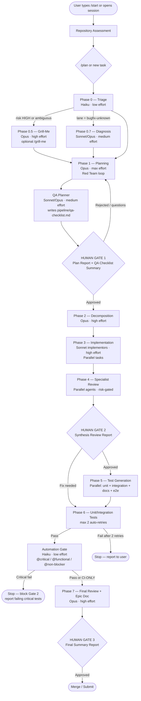

---

## Effort Levels at Every Step

Effort controls how much deliberation a phase spends — independent of the model tier.

| Level | Meaning |
|-------|---------|
| **low** | Single pass, minimal deliberation. Mechanical/cheap steps. |
| **medium** | Standard deliberation; covers obvious cases and common failure modes. |
| **high** | Thorough — weighs alternatives, edge cases, re-reads before output. |
| **max** | Exhaustive — multi-pass, adversarial self-review, no token-budget concern. |

```mermaid
gantt
    title Pipeline Phases — Model × Effort
    dateFormat X
    axisFormat %s

    section Phase 0
    Triage · Haiku · LOW              :0, 1
    section Phase 0.5
    Grill-Me · Opus · HIGH (opt-in)   :0, 1
    section Phase 0.7
    Diagnosis · Sonnet/Opus · MEDIUM  :0, 1
    section Phase 1
    Planning + Red Team · Opus · MAX  :0, 1
    QA Planner · Sonnet/Opus · MEDIUM :0, 1
    Gate Translator · Haiku · MEDIUM  :0, 1
    section Phase 2
    Decomposition · Opus · HIGH       :0, 1
    section Phase 3
    Implementors · Sonnet · HIGH      :0, 1
    section Phase 4
    Security Auditor · Opus · MAX     :0, 1
    Perf/Arch Reviewers · Sonnet · HIGH :0, 1
    Synthesis · Opus · HIGH           :0, 1
    section Phase 5
    Test Writer · Sonnet · MEDIUM     :0, 1
    Docs Writer · Haiku · LOW         :0, 1
    E2E Test Writer · Sonnet · MEDIUM :0, 1
    section Phase 6
    Fix Cycles · Sonnet · HIGH        :0, 1
    Automation Gate · Haiku · LOW     :0, 1
    section Phase 7
    Final Review · Opus · HIGH        :0, 1
    Epic Doc Writer · Sonnet · MEDIUM :0, 1
```

Reference table (the canonical source):

| Phase / Step | Model | Effort |
|---|---|---|
| Phase 0 — Triage | Haiku | low |
| Phase 0.5 — Intent Extraction (grill-me) | Opus | high |
| Phase 0.7 — Diagnosis (bugfix-unknown) | Sonnet → Opus if elusive | medium → high |
| Phase 1 — Planning + Red Team | Opus | max |
| Gate Translator (Gates 1 / 2 / 3) | Haiku | medium |
| Phase 2 — Decomposition | Opus | high |
| Phase 3 — Implementation | Sonnet | high |
| Phase 4 — Security Auditor | Opus | max |
| Phase 4 — Performance / Architecture Reviewer | Sonnet | high |
| Phase 4 — Synthesis | Opus | high |
| Phase 1 / 4 — Pricing Reviewer (tag-gated) | Sonnet | low |
| Phase 5 — Test Writer (no auth/PII) | Sonnet | medium |
| Phase 5 — Test Writer (auth or PII flags) | Opus | high |
| Phase 5 — Docs Writer | Haiku | low |
| Phase 6 — Fix Cycles | Sonnet | high |
| Phase 7 — Final Review | Opus | high |
| Phase 7 — Epic Doc Writer | Sonnet | medium |
| Phase 1 — QA Planner | Sonnet → Opus if auth/PII | medium → high |
| Phase 5 — E2E Test Writer | Sonnet | medium |
| Phase 6 — Automation Gate | Haiku | low |

> You can override any step: `"run planning at max effort"` or globally `"set effort to high"`. The orchestrator records the chosen effort in `pipeline/progress.md`.

---

## Adaptive Lanes

Triage (Phase 0) picks one of five lanes. The lane right-sizes the pipeline — heavier lanes add more ceremony, lighter lanes collapse or skip phases.

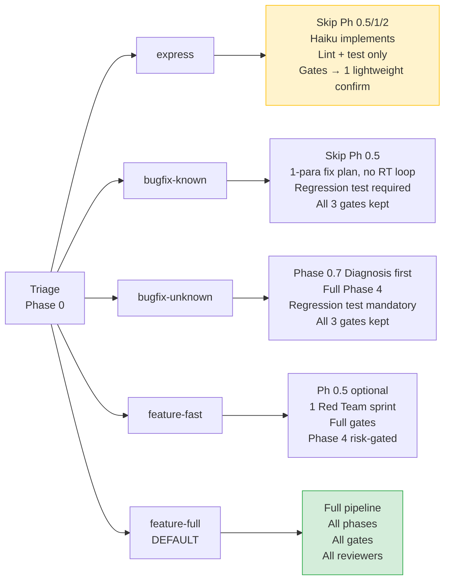

**Lane fail-safe (non-negotiable):** If `risk_level = HIGH` OR any risk flag is set (auth, PII, payment, public API, admin, file upload), Triage **must** set `lane = feature-full` regardless of apparent task size.

---

## Agent Roles and Orchestrator Flow

The Lead Orchestrator never implements code. It coordinates all agents and is the sole writer of `TODO.md`.

```mermaid
flowchart TD
    O([Lead Orchestrator\nOpus])

    O -->|Phase 0| HA[Haiku — Triage]
    O -->|Phase 0.5 opt-in| GB[Opus — Grill-Me]
    O -->|Phase 0.7 bugfix-unknown| DG[Sonnet/Opus — Diagnosis]
    O -->|Phase 1| RT[Opus — Red Team\n3 stances in 1 pass]
    O -->|Phase 1 Gate| TR1[Haiku — Translator\nGate 1 report]
    O -->|Phase 2| DC[Opus — Decomposition\npipeline/tasks/T-XX.json]
    O -->|Phase 3 parallel| IM1[Sonnet — Implementor T-01]
    O -->|Phase 3 parallel| IM2[Sonnet — Implementor T-02]
    O -->|Phase 3 parallel| IMN[Sonnet — Implementor T-NN]
    O -->|Phase 4 parallel| SA[Opus — Security Auditor]
    O -->|Phase 4 parallel| PR[Sonnet — Performance Reviewer]
    O -->|Phase 4 parallel| AR[Sonnet — Architecture Reviewer]
    O -->|Phase 4 if pricing tag| PXR[Sonnet — Pricing Reviewer]
    O -->|Phase 4 Gate| TR2[Haiku — Translator\nGate 2 report]
    O -->|Phase 5 parallel| TW[Sonnet — Test Writer\nunit + integration]
    O -->|Phase 5 parallel| DW[Haiku — Docs Writer]
    O -->|Phase 6 fix| FX[Sonnet — Implementor fix]
    O -->|Phase 7| ED[Sonnet — Epic Doc Writer]
    O -->|Phase 7 Gate| TR3[Haiku — Translator\nGate 3 report]

    subgraph "Human Gates (orchestrator stops here)"
        G1[Gate 1 — Plan approved?]
        G2[Gate 2 — Review approved?]
        G3[Gate 3 — Final approved?]
    end

    TR1 --> G1
    TR2 --> G2
    TR3 --> G3

    style O fill:#0d6efd,color:#fff
    style G1 fill:#fd7e14,color:#fff
    style G2 fill:#fd7e14,color:#fff
    style G3 fill:#fd7e14,color:#fff
```

### Agent Quick Reference

| Agent | Model | Phase | Role |
|---|---|---|---|
| `implementor` | Sonnet | 3, 6 | Writes code within strict scope contracts |
| `red-team` | Opus | 1 | Attacks the plan from 3 stances simultaneously |
| `security-auditor` | Opus (pinned) | 4 | Auth, input validation, sensitive data, session |
| `performance-reviewer` | Sonnet | 4 | N+1s, blocking ops, memory leaks, scaling |
| `architecture-reviewer` | Sonnet | 1 (memo), 4 | Structure, coupling, naming, API design |
| `pricing-reviewer` | Sonnet | 1, 4 | Tier-gating, billing (only when `pricing` tag set) |
| `test-writer` | Sonnet / Opus | 5 | Unit + integration tests, security-adjacent tests |
| `docs-writer` | Haiku | 5 | Non-obvious comments, API refs, README |
| `translator` | Haiku | 1, 2, 3 gates | Converts technical reports to plain English |
| `epic-doc-writer` | Sonnet | 7 | Collated delivery doc at `docs/epics/<slug>.md` |
| `qa-planner` | Sonnet → Opus if auth/PII | 1 (end, before Gate 1) | Reads the plan; writes `pipeline/qa-checklist.md` with 🔴/🟡/🟢 test tiers |
| `e2e-test-writer` | Sonnet | 5 | Translates `qa-checklist.md` into tagged Playwright tests; bootstraps config on first run |

---

## Phase 4 Reviewer Gating

Which reviewers fire in Phase 4 depends on `lane × risk_level`:

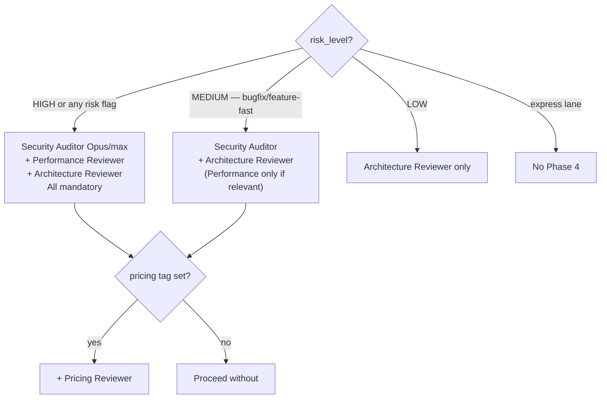

> The security-auditor is **never** gated out when `risk_level = HIGH` or any auth/PII/payment risk flag is set. No lane override can remove it.

---

## Conditional Specialists (tag-gated)

Tags are set by Triage based on what the task actually touches:

| Tag | Specialist | When it fires |
|---|---|---|
| `pricing` | `pricing-reviewer` | Phase 1 (constraint memo) + Phase 4 (review) |
| `frontend` | `architecture-reviewer` with frontend lens | Phase 4 |
| `backend` | `architecture-reviewer` with backend lens | Phase 4 |
| `infra` | `architecture-reviewer` with infra lens | Phase 4 |
| `product` | Orchestrator reads `business.md` directly | Phase 1 |

For large epics (`risk_level = HIGH` AND ≥ 3 tags), a **bounded Phase-1 constraint round** runs: each tagged specialist submits one memo → orchestrator synthesises → Red Team loop continues. Hard cap: exactly one round, no agent-to-agent messaging.

---

## Red Team Loop (Phase 1)

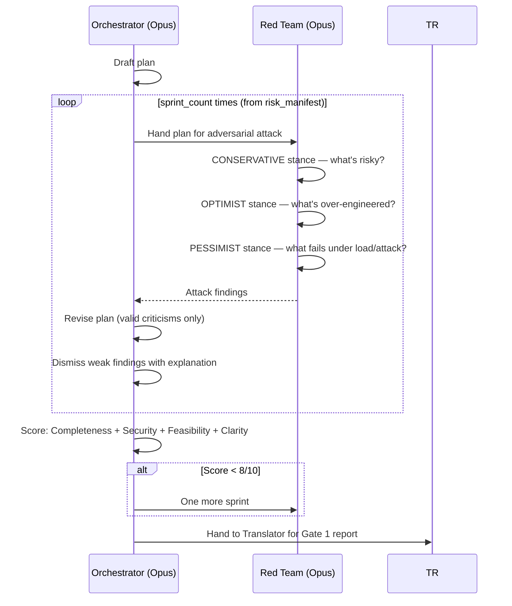

---

## Human Gates — What Stops the Pipeline

The orchestrator **stops completely** at each gate and waits for explicit approval. No pre-generation, no hints.

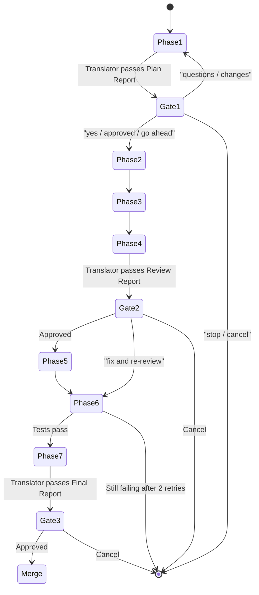

**Express-lane exception:** the three gates collapse into one lightweight confirmation — still Translator-passed, still a human approval, never skipped.

---

## Pipeline Artifacts (what gets written where)

| File / Path | Writer | Purpose |
|---|---|---|
| `pipeline/risk_manifest.json` | Orchestrator (Phase 0) | Risk level, tags, lane, sprint count |
| `pipeline/diagnosis.md` | Orchestrator (Phase 0.7) | Root cause + blast radius |
| `pipeline/progress.md` | Orchestrator (every phase boundary) | Live pipeline state, effort overrides |
| `pipeline/tasks/T-XX.json` | Orchestrator (Phase 2) | Atomic task contracts |
| `TODO.md` | Orchestrator only (regenerated each phase boundary) | Human-readable mirror of tasks |
| `pipeline/reviews/*.md` | Specialist reviewers (Phase 4) | Individual audit reports |
| `docs/epics/<slug>.md` | Epic Doc Writer (Phase 7 or /epic-doc) | Collated delivery document |

> Agents read `TODO.md` for context but **never write it**. The orchestrator is the sole writer. This is strictly enforced to avoid parallel write conflicts in Phase 3.

---

## Slash Commands — Quick Reference

| Command | Phases triggered | When to use |
|---|---|---|
| `/start` | Assessment | Opening a new session or onboarding to a new repo |
| `/grill-me` | Phase 0.5 | Before planning — want to stress-test intent first |
| `/diagnose` | Phase 0.7 | Bug with unknown root cause — investigate before planning |
| `/plan` | Phase 0 + Phase 1 | Start planning a new task; stops at Gate 1 |
| `/implement` | Phase 2 + Phase 3 | After Gate 1 approval; decompose and build |
| `/review` | Phase 4 | Run all specialist reviewers; stops at Gate 2 |
| `/test` | Phase 5 + Phase 6 | Generate and run unit + integration tests |
| `/fix` | Phase 6 only | Drive failing tests to green without re-running the full pipeline |
| `/qa-plan` | QA Planner (Phase 1 on demand) | Generate or refresh `qa-checklist.md` without running the full pipeline |
| `/epic-doc` | Phase 7 (on demand) | Produce collated delivery doc mid-pipeline or at end |

---

## How to Work Properly Within This System

### Starting a new task

```
1. /start          → read the repo state
2. /plan           → describe your task; Triage classifies it
3. Review Gate 1   → read the translated Plan Report
4. Accept / reject optional recommendations (capped at 2 AI rounds)
5. /implement      → after approval; approve task list
6. /review         → after implementation
7. Review Gate 2   → check findings; approve or request fixes
8. Gate 3          → final approval before merge
```

### Adding a security module

1. Create `src/lib/scanner/modules/p1-NN-name.ts` exporting `runNameModule(crawl): Promise<RawFinding[]>`.
2. Import and add it to the correct group in `src/lib/scanner/index.ts`.
3. Add display metadata to `SCAN_MODULES` in `src/lib/data.ts`.
4. No migration needed — no schema change.

### Modifying business/pricing facts

Edit **only** `.claude/project/business.md`. This is the single source of truth. Never duplicate tier or price facts elsewhere — the `pricing-reviewer` agent reads this file directly.

### Setting effort for a phase

```
"run planning at max effort"          # one-off override
"set effort to high for all phases"   # global override
```
The orchestrator records it in `pipeline/progress.md` and passes it explicitly to each agent.

### Overriding the lane

You can state the desired lane upfront:
```
"treat this as bugfix-known — fix is in lib/scanner/modules/p1-07-cors.ts"
```
Triage will honour it unless the lane fail-safe applies (HIGH risk or a risk flag overrides to `feature-full`).

### When a gate blocks progress

Human gates never auto-proceed. If you want the pipeline to continue:
- Say `yes`, `approved`, or `go ahead`.
- Ask questions first — the orchestrator will answer fully before continuing.
- Say `stop` or `cancel` to halt and get a completion summary.

### Adding a new project fact

1. Decide which file it belongs to: `overview.md` (what), `business.md` (tiers/pricing), or `technical.md` (stack/patterns).
2. Edit that file only.
3. Commit in the same PR as the code change it describes.
4. Never duplicate a fact across files — if you find a duplicate, remove one.

---

## Real-World Example Scenarios (E-Commerce App)

The examples below use a fictional e-commerce platform — **ShopFlow** — with a product catalogue, cart, guest/registered checkout, Stripe payments, seller image uploads, and an admin order dashboard. Each scenario shows the exact prompt to type, what Triage classifies it as, which agents fire, and what to expect at each gate.

---

### Scenario 1 — Typo fix on the cart page (express lane)

**Situation:** The "Proceed to Checkout" button on the cart page reads "Procced to Checkout".

**Prompt to type:**
```
Fix the typo on the cart page — the checkout button says "Procced to Checkout",
it should say "Proceed to Checkout".
```

**What Triage assigns:**

| Field | Value |
|---|---|
| Lane | express |
| Risk level | LOW |
| Tags | frontend |
| Agents | None (Haiku implements directly) |
| Gates | 1 lightweight confirmation (gates collapsed) |

**What happens:**

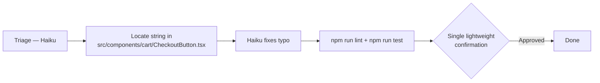

> Express lane — no planning phase, no Red Team, no specialist review. One gate. Permitted only because risk is LOW and no risk flag applies.

---

### Scenario 2 — Known discount-calculation bug (bugfix-known)

**Situation:** When a user applies a discount code AND qualifies for free shipping, the cart total is wrong. The bug is suspected to be in `lib/cart/discounts.ts`.

**Prompt to type:**
```
Bug: cart total is wrong when a discount code is applied alongside free shipping.
The bug is in lib/cart/discounts.ts — looks like discount is applied before the
shipping credit, causing double-subtraction. Fix it and add a regression test.
```

**What Triage assigns:**

| Field | Value |
|---|---|
| Lane | bugfix-known |
| Risk level | MEDIUM |
| Tags | backend |
| Agents | Implementor (Sonnet), Architecture Reviewer (Phase 4) |
| Gates | All 3 kept; Gate 1 is lightweight (1-para plan, no Red Team loop) |

**What happens:**

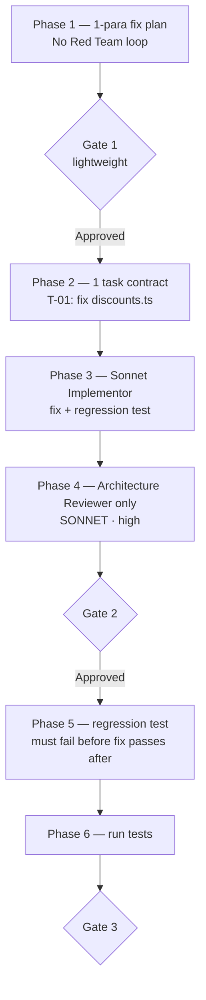

**Gate 1 plan looks like:**
> Fix the discount stacking order in `lib/cart/discounts.ts` so shipping credit is applied before percentage discounts. Add one regression test for the combined-discount case.

---

### Scenario 3 — Cart randomly empties after login (bugfix-unknown)

**Situation:** Several users report their cart empties after they log in. It's intermittent and can't be reproduced consistently. Root cause is unknown.

**Prompt to type:**
```
Bug report: users say their cart empties after logging in. We can't reproduce it
reliably — happens maybe 1 in 5 logins. No error in logs. Diagnose first, then fix.
```

**What Triage assigns:**

| Field | Value |
|---|---|
| Lane | bugfix-unknown |
| Risk level | HIGH (touches auth sessions) |
| Tags | backend, frontend |
| Agents | Diagnosis (Phase 0.7), then full Phase 4 set |
| Gates | All 3 kept; Phase 0.7 runs before any plan |

**What happens:**

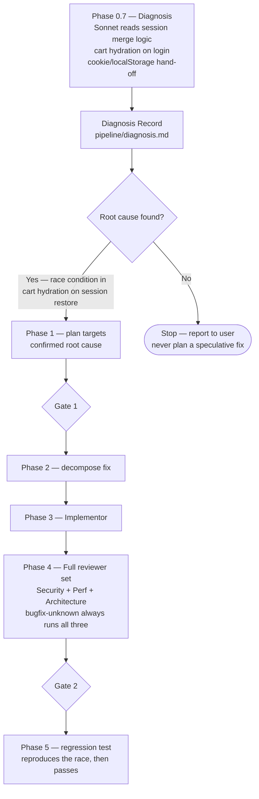

**Diagnosis record excerpt (pipeline/diagnosis.md):**
```
Root cause: cart state is hydrated from localStorage before the session
cookie is set, so the post-login session triggers a second hydration with
an empty server-side cart, overwriting the localStorage cart.

File: src/lib/cart/cart-hydration.ts:88
Mechanism: useEffect dependency array fires on sessionStatus === 'authenticated'
before the merge step at line 102 completes.

Blast radius: any flow that transitions unauthenticated → authenticated while
a cart exists (login, OAuth callback, token refresh).
```

---

### Scenario 4 — Recently Viewed Products section (feature-fast)

**Situation:** Product managers want a "Recently Viewed" row on the product detail page showing the last 5 items the user browsed, stored in localStorage. No backend change needed.

**Prompt to type:**
```
Add a "Recently Viewed Products" section to the product detail page.
Show the last 5 products the user viewed, stored in localStorage.
Only show it if there are at least 2 items. No backend changes needed.
```

**What Triage assigns:**

| Field | Value |
|---|---|
| Lane | feature-fast |
| Risk level | LOW |
| Tags | frontend |
| Red Team sprints | 1 (feature-fast always exactly 1) |
| Agents | Implementor (Sonnet), Architecture Reviewer (Phase 4) |
| Gates | All 3 kept |

**What happens:**

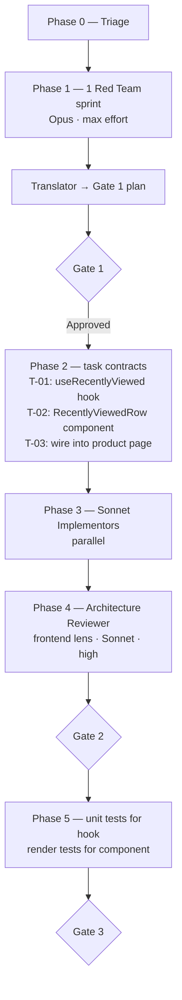

**Gate 1 Plan Report (abbreviated):**
```
WHAT WE ARE BUILDING
A hook that reads/writes a product-ID list in localStorage, capped at 5,
and a display row component that fetches those product thumbnails and
renders them. It only appears once 2+ items exist.

WHAT COULD GO WRONG
Risk: SSR mismatch — localStorage is browser-only; accessing it during
server render throws. Defence: guard with typeof window !== 'undefined'
and initialise state lazily.

OPTIONAL RECOMMENDATIONS
R1: Sync recently viewed across devices via the user's session (backend key).
    Value: better experience for logged-in users.
    Tradeoff: requires a DB column + API route — adds backend scope.
```

---

### Scenario 5 — Guest checkout flow (feature-full · HIGH)

**Situation:** Allow users to buy without creating an account. Capture email for order confirmation. Offer account creation post-purchase.

**Prompt to type:**
```
Add guest checkout. Users should be able to complete a purchase without
registering. We capture their email for the order confirmation. After
payment succeeds show an optional "Create an account" prompt.
The existing registered checkout flow must not be affected.
```

**What Triage assigns:**

| Field | Value |
|---|---|
| Lane | feature-full (auth risk flag → fail-safe) |
| Risk level | HIGH |
| Risk flags | auth, PII (email captured), payment |
| Tags | frontend, backend, pricing |
| Red Team sprints | 3 (from risk_manifest.sprint_count) |
| Agents | All mandatory: Security Auditor (Opus/max), Performance Reviewer, Architecture Reviewer, Pricing Reviewer |
| Gates | All 3 kept, no collapse |

**What happens:**

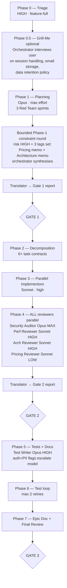

**Sample Grill-Me questions (Phase 0.5):**
```
Q1: Should guest sessions use a signed cookie or a short-lived JWT?
    Recommended: signed cookie (same mechanism as registered sessions — less surface).

Q2: How long should we retain guest order data if they never create an account?
    Recommended: 2 years (matches standard e-commerce retention for dispute windows).

Q3: Can a guest apply a discount code?
    Recommended: yes — applying the existing discount engine with no tier-gate.

Q4: Should the "Create account" prompt pre-fill the captured email?
    Recommended: yes — reduces friction, data is already in our session.
```

**Sample task contracts (Phase 2):**
```
T-01: Guest session token — create + validate (backend)
T-02: Checkout API — accept guest payload with email (backend)
T-03: Guest checkout form component (frontend)
T-04: Order confirmation email for guests (backend)
T-05: Post-purchase account creation prompt (frontend)
T-06: Tier-gate audit — confirm guest orders do not unlock paid tiers (pricing)
```

**Security Auditor findings (Gate 2 excerpt):**
```
🔴 Critical: Guest session token must be signed and scoped to one order —
   prevent reuse or enumeration. Fix: HMAC-sign with NEXTAUTH_SECRET,
   embed order ID + expiry, validate on every order status request.

🟡 Medium: Guest email stored in plain-text in the Stripe metadata field —
   redact before logging. Fix: mask to "j***@example.com" in all log lines.

🟢 Low: "Create account" form re-POSTs the email — safe, but consider
   pre-filling from the session to avoid a second transmission.
```

---

### Scenario 6 — Stripe subscription tiers (feature-full · HIGH + pricing)

**Situation:** Add a "VIP Membership" — $14.99/month subscription giving free shipping, early sale access, and priority support. Integrate Stripe billing, webhook handling, and a member-only badge on orders.

**Prompt to type:**
```
Add a VIP Membership subscription — $14.99/month via Stripe. Members get:
free shipping on all orders, early access to sales (24h before public),
and a "VIP" badge on their profile and order history.
Handle the Stripe webhook for subscription events (created, cancelled,
payment failed). Gate the early-access sale page behind the membership.
```

**What Triage assigns:**

| Field | Value |
|---|---|
| Lane | feature-full (payment risk flag → fail-safe) |
| Risk level | HIGH |
| Risk flags | payment/billing, auth (session tier update) |
| Tags | frontend, backend, pricing |
| Conditional specialists | Pricing Reviewer (mandatory — `pricing` tag set) |
| Gates | All 3, no collapse |

**Pricing Reviewer constraint memo (Phase 1 input):**
```
New tier "vip" must slot into the existing hierarchy:
free → one-shot → pro → studio

Decision needed: does "vip" sit between pro and studio, or is it
a parallel track (ship-speed vs quality)?

PAYMENT_TEST_FLOW=true must still work in dev/staging for the new tier.
The Stripe webhook endpoint must hard-fail if NODE_ENV === 'production'
and PAYMENT_TEST_FLOW is set — existing guard applies, extend it.

Stripe price ID to add: STRIPE_PRICE_ID_VIP_MONTHLY
```

**Sample task contracts (Phase 2):**
```
T-01: Add "vip" to tier hierarchy in lib/auth/helpers.ts + tier-gating.ts
T-02: Stripe checkout session for VIP subscription
T-03: Webhook handler — subscription.created / deleted / payment_failed
T-04: Update Prisma User model — add subscriptionId, vipSince fields
T-05: Free-shipping logic gate in checkout API (hasTier 'vip')
T-06: Early-access sale page — middleware + hasTier guard
T-07: VIP badge component — profile page + order history
T-08: PAYMENT_TEST_FLOW extension for new vip tier (dev/staging only)
```

---

### Scenario 7 — Seller product image upload (feature-full · HIGH)

**Situation:** Sellers can upload up to 5 product images (max 5 MB each, JPEG/PNG/WebP). Store them in Cloudflare R2. Serve via a CDN URL.

**Prompt to type:**
```
Sellers need to upload product images — up to 5 images per product,
max 5 MB each, JPEG/PNG/WebP only. Store in Cloudflare R2, serve via CDN.
Validate file type server-side (not just by extension). Show an upload
progress bar. Reject oversized or wrong-type files with a clear error.
```

**What Triage assigns:**

| Field | Value |
|---|---|
| Lane | feature-full (file upload risk flag → fail-safe) |
| Risk level | HIGH |
| Risk flags | file upload / user-generated content |
| Tags | frontend, backend, infra |
| Agents | All 3 mandatory reviewers; Security Auditor Opus/max |
| Gates | All 3 kept |

**Red Team attack summary (Phase 1, pessimist stance):**
```
PESSIMIST findings:
- Magic-byte validation can be fooled by polyglot files (JPEG header +
  embedded SVG with XSS payload). Defence: validate with sharp/file-type
  library, re-encode via sharp to strip metadata, never serve the raw upload.

- Filename used as R2 key allows path traversal if not sanitised.
  Defence: always generate a UUID key, discard the original filename.

- 5 MB × 5 images = 25 MB per product; a seller could flood storage with
  unsaved drafts. Defence: enforce upload only after product draft exists;
  cron cleanup of orphaned blobs older than 24h.

- Signed R2 upload URL must scope to a single object key and expire
  within 5 minutes to prevent URL reuse.
```

**Security Auditor findings (Gate 2 excerpt):**
```
🔴 Critical: Raw file stored at upload URL before validation — an attacker
   can upload a malicious file and share the CDN URL before the server
   re-encodes it. Fix: upload to a quarantine prefix, re-encode with
   sharp, then move to public prefix. CDN serves only the public prefix.

🔴 Critical: MIME type read from Content-Type header (client-controlled).
   Fix: use the `file-type` library to sniff magic bytes server-side;
   reject if type does not match JPEG/PNG/WebP.

🟡 Medium: No rate limit on presigned URL generation — a seller could
   request thousands of upload URLs. Fix: 20 upload URLs per seller per hour.
```

---

### Scenario 8 — Admin order dashboard with refunds (feature-full · HIGH)

**Situation:** Internal admin page listing all orders, allowing staff to search by customer email, issue partial or full refunds via Stripe, and flag accounts for review.

**Prompt to type:**
```
Build an admin order dashboard. Admins (from ADMIN_EMAILS) can:
- View all orders, paginated, searchable by customer email or order ID
- Issue a full or partial refund for any order via Stripe
- Flag a user account with a reason (shows a warning on their next login)
Admin routes should 404 to non-admins (not 403 — don't reveal the route exists).
```

**What Triage assigns:**

| Field | Value |
|---|---|
| Lane | feature-full (admin/privileged + payment risk flags → fail-safe) |
| Risk level | HIGH |
| Risk flags | admin/privileged access, payment/billing, PII (customer emails visible) |
| Tags | frontend, backend, pricing |
| Agents | All mandatory; Security Auditor Opus/max |
| Gates | All 3 kept |

**Gate 1 decisions the plan surfaces:**
```
DECISIONS YOU NEED TO MAKE

□ Should partial refunds reduce the order total in our DB, or only in Stripe?
  (Keeping them in sync avoids confusion in the dashboard; requires a schema change.)

□ Should flagged accounts be blocked from checkout immediately, or only shown a warning?
  (Immediate block is safer but may be too aggressive for a first version.)

□ Audit log: do we need a record of which admin issued each refund and flag action?
  (Recommended yes — required for dispute handling and SOC 2 if you ever pursue it.)
```

**Task contracts (Phase 2, abbreviated):**
```
T-01: Admin order list API — cursor-paginated, search by email/order ID,
      assertAdminApi() guard, 404 for non-admins
T-02: Admin refund API — full/partial, Stripe refund call, update Order row,
      write audit log entry
T-03: Admin flag-account API — write UserFlag row + reason, assertAdminApi()
T-04: Flag warning component — shown on next login if flag exists
T-05: Admin dashboard page — table + search UI, only reachable by admin session
T-06: Audit log Prisma model + migration
```

---

### Scenario 9 — Using /grill-me before planning a complex feature

**Situation:** You want to add a loyalty points system but aren't sure about the business rules, expiry policy, or how it integrates with the existing tier system.

**Prompt to type:**
```
/grill-me I want to add a loyalty points system — earn points on purchases,
redeem for discounts. I haven't decided the rules yet.
```

**What happens in Phase 0.5:**

```mermaid
sequenceDiagram
    participant U as You
    participant G as Grill-Me (Opus · high)

    G->>U: Q1: Should points expire? If yes, after how long?\n Recommended: 12 months from last activity.
    U->>G: Yes, 12 months.
    G->>U: Q2: Earn rate — flat (e.g. 1 point per $1) or tiered by membership?\n Recommended: flat to start; tiered is a future upgrade.
    U->>G: Flat — 1 point per $1.
    G->>U: Q3: Redemption — any order, or minimum threshold?\n Recommended: minimum 100 points ($1 value) to avoid micro-redemptions.
    U->>G: 100-point minimum.
    G->>U: Q4: Can points be earned on orders that later get refunded?\n Recommended: reverse points on refund, not on return initiation.
    U->>G: Reverse on refund.
    G->>G: No more open branches — decision tree resolved.
    G-->>U: Resolved Decision Record:\n• 1pt / $1 earned, reversed on Stripe refund event\n• Expire after 12 months of account inactivity\n• Min 100pts to redeem, applied as order discount\n• No tier interaction in v1
```

**Then /plan runs with this record folded in — Gate 1 is a clean yes/no, not a renegotiation.**

---

### Prompt Patterns Cheat Sheet

| Situation | What to type |
|---|---|
| Typo / label / comment fix | Describe it directly — Triage picks express automatically |
| Known bug with a file hint | `"Bug in lib/X.ts: [symptom]. Fix is [approach]."` |
| Intermittent or mysterious bug | `"Bug: [symptom]. Can't reproduce reliably. Diagnose first."` |
| Small UI feature, no backend | `"Add [feature] to [page]. No backend changes."` |
| Auth or payment feature | Describe requirements — HIGH risk + feature-full are automatic |
| File upload | Describe requirements — HIGH risk flag fires automatically |
| Admin feature | Describe requirements — privileged access flag fires automatically |
| Unsure about requirements | `/grill-me [description]` — clarify before planning |
| Want a plan first, no code yet | `/plan [description]` — stops at Gate 1 |
| Ready to build after Gate 1 | `/implement` — decomposes + builds |
| Want to review existing code | `/review` — runs all Phase 4 specialists |
| Want delivery documentation | `/epic-doc` — writes `docs/epics/<slug>.md` |

---

## QA Automation Flow

### How the QA Planner + Automation Gate work together

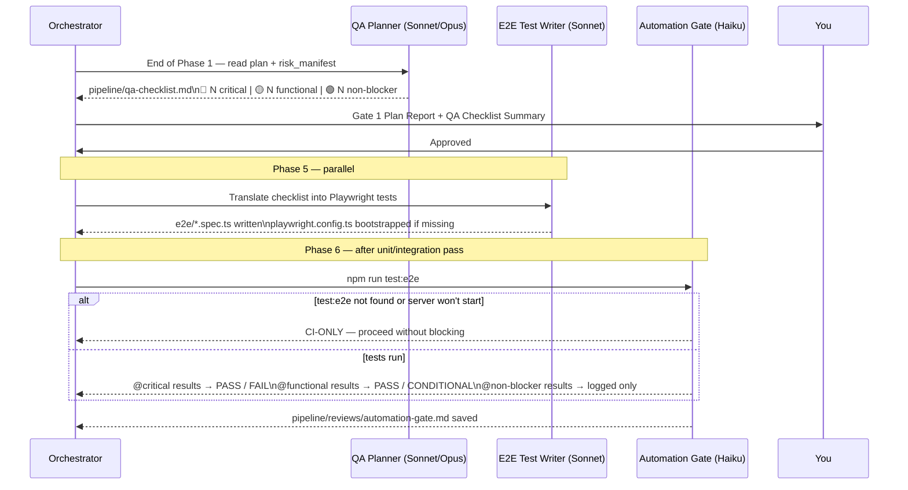

### Severity tier behaviour at each gate

| Tier | Phase 6 Automation Gate | Gate 2 verdict impact | Final Summary |
|---|---|---|---|
| 🔴 Critical | Blocks on failure | Fail → must fix before Gate 2 | Always shown |
| 🟡 Functional | Does not block | Failures → CONDITIONAL PASS conditions | Always shown |
| 🟢 Non-blocker | Does not block | No impact | Logged in automation-gate.md |
| CI-ONLY | No gate impact | No impact | Noted as pending CI |

### Automating only what makes sense

The E2E test writer marks items `Automatable: no` with a skip and a reason. Not every QA checklist item should be automated:

| Example | Automation verdict |
|---|---|
| "User can complete checkout with a valid card" | yes — Playwright can fill the form and assert redirect |
| "PDF export renders correctly across browsers" | partial — can assert download, not visual fidelity |
| "Support team verifies fraud flags in admin panel" | no — requires human judgement |
| "Payment terminal shows correct charge amount" | no — requires physical hardware |

---

## Key Constraints to Remember

- **Orchestrator never writes code.** It plans, decomposes, and synthesises. Implementors write code.
- **Security auditor always uses Opus at max effort** when `risk_level = HIGH`. No lane can override this.
- **`TODO.md` is read-only for all agents.** Only the orchestrator regenerates it at phase boundaries.
- **2 auto-retry max in Phase 6.** After that, the orchestrator stops and reports to the user — never silently retries.
- **AI recommendations are capped at 2 rounds.** Requirements *you* add are always honoured and never counted against the cap.
- **The security auditor is pinned to a dated model ID** (in `agents/security-auditor.md`) so audit results are comparable run-to-run. All other agents use tier aliases.
