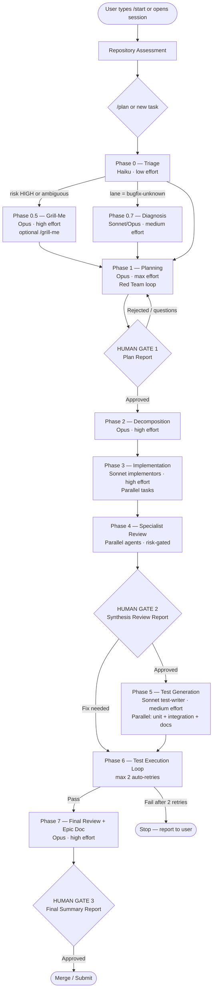
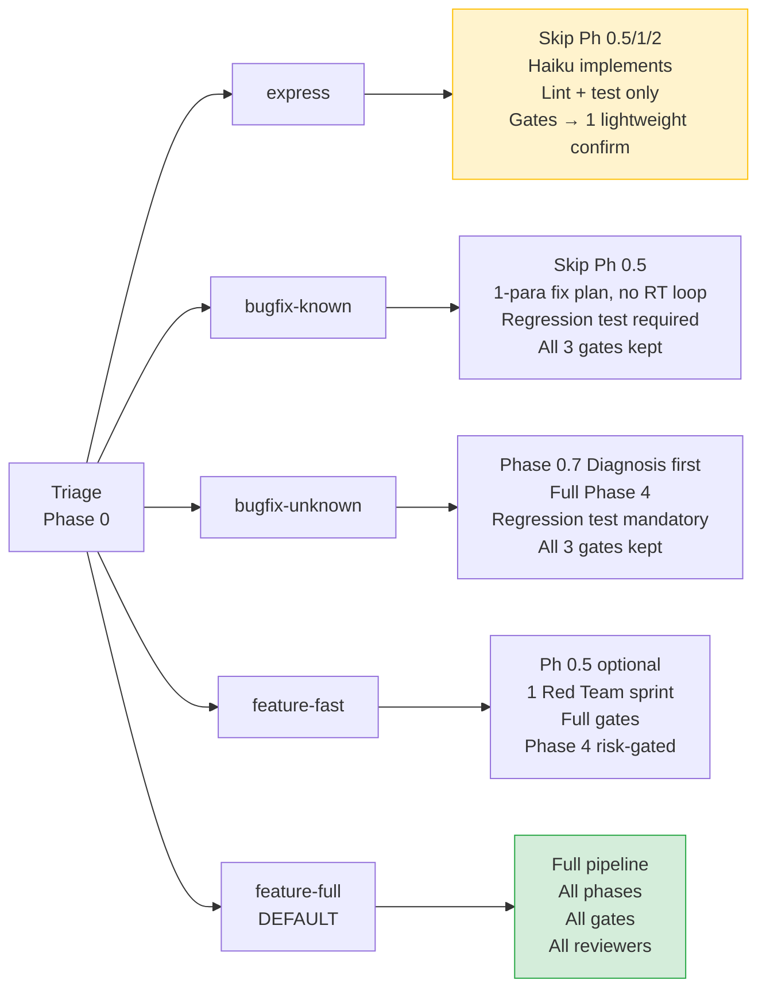
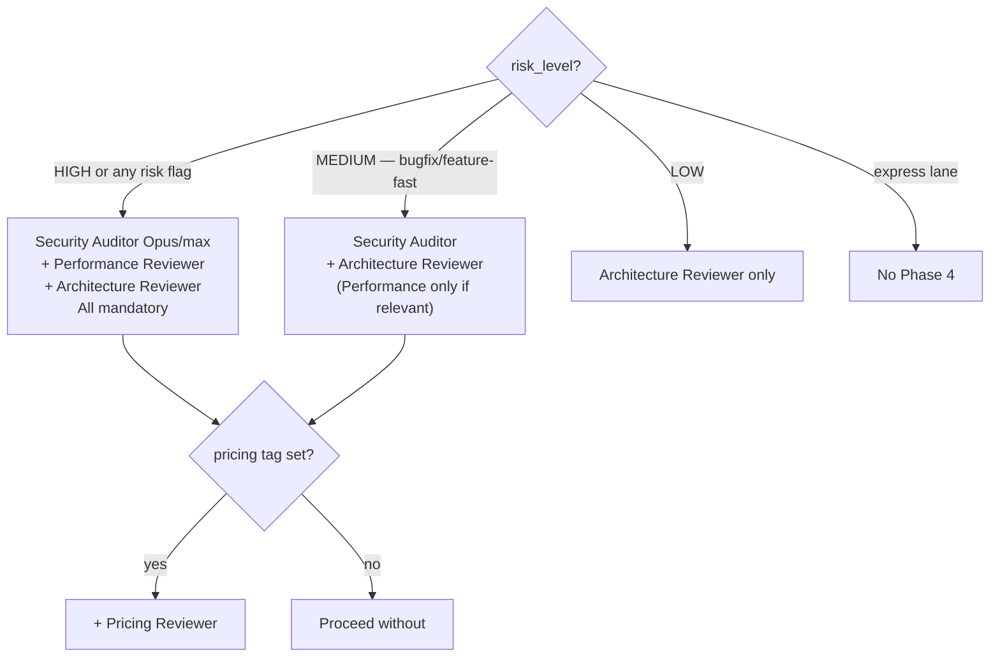
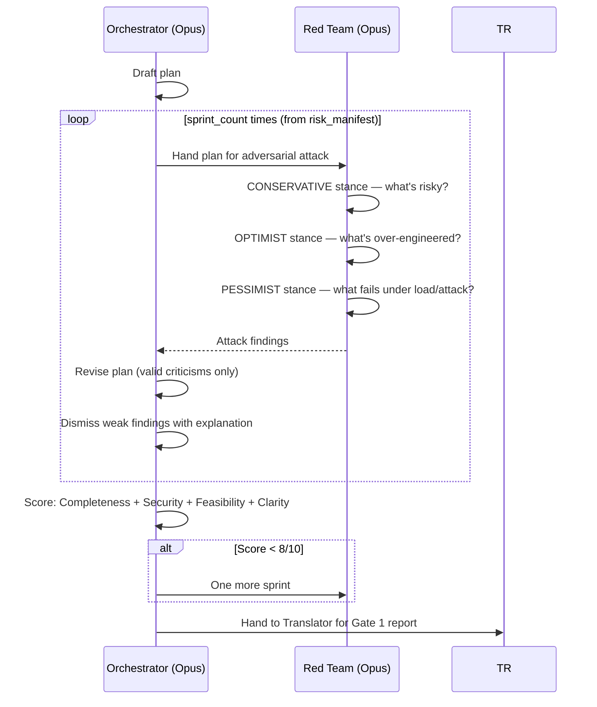
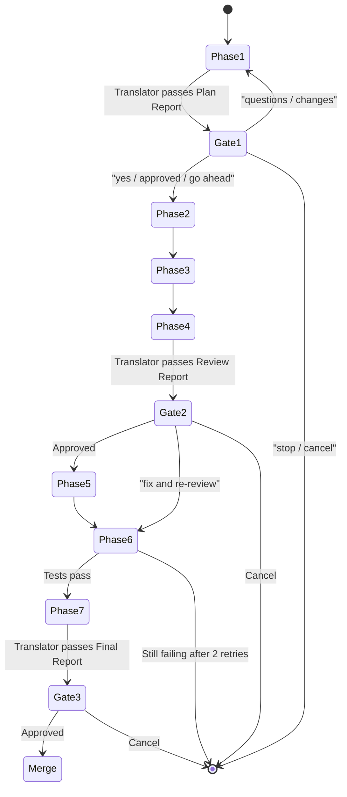

# Claude Code Workflow — How `.claude/` Works

This document explains the autonomous AI pipeline defined in `.claude/` and `CLAUDE.md`. It covers the directory layout, every pipeline phase, agent roles, adaptive lanes, effort levels, and practical guidance for working within the system.

---

## Directory Layout

```
.claude/
├── settings.json          # Permissions allowlist (MCP tools, bash commands)
├── agents/                # Specialist agent definitions (model + role)
│   ├── implementor.md
│   ├── red-team.md
│   ├── security-auditor.md
│   ├── performance-reviewer.md
│   ├── architecture-reviewer.md
│   ├── pricing-reviewer.md
│   ├── test-writer.md
│   ├── docs-writer.md
│   ├── translator.md
│   └── epic-doc-writer.md
├── commands/              # Slash commands wired to pipeline phases
│   ├── start.md           # /start  → Repository Assessment
│   ├── plan.md            # /plan   → Phase 0 + Phase 1
│   ├── implement.md       # /implement → Phase 2 + Phase 3
│   ├── review.md          # /review → Phase 4
│   ├── grill-me.md        # /grill-me → Phase 0.5
│   └── epic-doc.md        # /epic-doc → Phase 7 delivery doc
└── project/               # Single-source-of-truth facts (never duplicated)
    ├── overview.md        # What the product does
    ├── business.md        # Tiers, pricing, Stripe facts
    └── technical.md       # Stack, patterns, gotchas
```

`CLAUDE.md` at the repo root is the master pipeline definition. It `@import`s the three project files above so every agent always has full context.

---

## The Full Pipeline — Phase by Phase



---

## Effort Levels at Every Step

Effort controls how much deliberation a phase spends — independent of the model tier.

| Level | Meaning |
|-------|---------|
| **low** | Single pass, minimal deliberation. Mechanical/cheap steps. |
| **medium** | Standard deliberation; covers obvious cases and common failure modes. |
| **high** | Thorough — weighs alternatives, edge cases, re-reads before output. |
| **max** | Exhaustive — multi-pass, adversarial self-review, no token-budget concern. |

```mermaid
gantt
    title Pipeline Phases — Model × Effort
    dateFormat X
    axisFormat %s

    section Phase 0
    Triage · Haiku · LOW              :0, 1
    section Phase 0.5
    Grill-Me · Opus · HIGH (opt-in)   :0, 1
    section Phase 0.7
    Diagnosis · Sonnet/Opus · MEDIUM  :0, 1
    section Phase 1
    Planning + Red Team · Opus · MAX  :0, 1
    Gate Translator · Haiku · MEDIUM  :0, 1
    section Phase 2
    Decomposition · Opus · HIGH       :0, 1
    section Phase 3
    Implementors · Sonnet · HIGH      :0, 1
    section Phase 4
    Security Auditor · Opus · MAX     :0, 1
    Perf/Arch Reviewers · Sonnet · HIGH :0, 1
    Synthesis · Opus · HIGH           :0, 1
    section Phase 5
    Test Writer · Sonnet · MEDIUM     :0, 1
    Docs Writer · Haiku · LOW         :0, 1
    section Phase 6
    Fix Cycles · Sonnet · HIGH        :0, 1
    section Phase 7
    Final Review · Opus · HIGH        :0, 1
    Epic Doc Writer · Sonnet · MEDIUM :0, 1
```



Reference table (the canonical source):

| Phase / Step | Model | Effort |
|---|---|---|
| Phase 0 — Triage | Haiku | low |
| Phase 0.5 — Intent Extraction (grill-me) | Opus | high |
| Phase 0.7 — Diagnosis (bugfix-unknown) | Sonnet → Opus if elusive | medium → high |
| Phase 1 — Planning + Red Team | Opus | max |
| Gate Translator (Gates 1 / 2 / 3) | Haiku | medium |
| Phase 2 — Decomposition | Opus | high |
| Phase 3 — Implementation | Sonnet | high |
| Phase 4 — Security Auditor | Opus | max |
| Phase 4 — Performance / Architecture Reviewer | Sonnet | high |
| Phase 4 — Synthesis | Opus | high |
| Phase 1 / 4 — Pricing Reviewer (tag-gated) | Sonnet | low |
| Phase 5 — Test Writer (no auth/PII) | Sonnet | medium |
| Phase 5 — Test Writer (auth or PII flags) | Opus | high |
| Phase 5 — Docs Writer | Haiku | low |
| Phase 6 — Fix Cycles | Sonnet | high |
| Phase 7 — Final Review | Opus | high |
| Phase 7 — Epic Doc Writer | Sonnet | medium |

> You can override any step: `"run planning at max effort"` or globally `"set effort to high"`. The orchestrator records the chosen effort in `pipeline/progress.md`.

---

## Adaptive Lanes

Triage (Phase 0) picks one of five lanes. The lane right-sizes the pipeline — heavier lanes add more ceremony, lighter lanes collapse or skip phases.



**Lane fail-safe (non-negotiable):** If `risk_level = HIGH` OR any risk flag is set (auth, PII, payment, public API, admin, file upload), Triage **must** set `lane = feature-full` regardless of apparent task size.

---

## Agent Roles and Orchestrator Flow

The Lead Orchestrator never implements code. It coordinates all agents and is the sole writer of `TODO.md`.


### Agent Quick Reference

| Agent | Model | Phase | Role |
|---|---|---|---|
| `implementor` | Sonnet | 3, 6 | Writes code within strict scope contracts |
| `red-team` | Opus | 1 | Attacks the plan from 3 stances simultaneously |
| `security-auditor` | Opus (pinned) | 4 | Auth, input validation, sensitive data, session |
| `performance-reviewer` | Sonnet | 4 | N+1s, blocking ops, memory leaks, scaling |
| `architecture-reviewer` | Sonnet | 1 (memo), 4 | Structure, coupling, naming, API design |
| `pricing-reviewer` | Sonnet | 1, 4 | Tier-gating, billing (only when `pricing` tag set) |
| `test-writer` | Sonnet / Opus | 5 | Unit + integration tests, security-adjacent tests |
| `docs-writer` | Haiku | 5 | Non-obvious comments, API refs, README |
| `translator` | Haiku | 1, 2, 3 gates | Converts technical reports to plain English |
| `epic-doc-writer` | Sonnet | 7 | Collated delivery doc at `docs/epics/<slug>.md` |

---

## Phase 4 Reviewer Gating

Which reviewers fire in Phase 4 depends on `lane × risk_level`:



> The security-auditor is **never** gated out when `risk_level = HIGH` or any auth/PII/payment risk flag is set. No lane override can remove it.

---

## Conditional Specialists (tag-gated)

Tags are set by Triage based on what the task actually touches:

| Tag | Specialist | When it fires |
|---|---|---|
| `pricing` | `pricing-reviewer` | Phase 1 (constraint memo) + Phase 4 (review) |
| `frontend` | `architecture-reviewer` with frontend lens | Phase 4 |
| `backend` | `architecture-reviewer` with backend lens | Phase 4 |
| `infra` | `architecture-reviewer` with infra lens | Phase 4 |
| `product` | Orchestrator reads `business.md` directly | Phase 1 |

For large epics (`risk_level = HIGH` AND ≥ 3 tags), a **bounded Phase-1 constraint round** runs: each tagged specialist submits one memo → orchestrator synthesises → Red Team loop continues. Hard cap: exactly one round, no agent-to-agent messaging.

---

## Red Team Loop (Phase 1)



---

## Human Gates — What Stops the Pipeline

The orchestrator **stops completely** at each gate and waits for explicit approval. No pre-generation, no hints.



**Express-lane exception:** the three gates collapse into one lightweight confirmation — still Translator-passed, still a human approval, never skipped.

---

## Pipeline Artifacts (what gets written where)

| File / Path | Writer | Purpose |
|---|---|---|
| `pipeline/risk_manifest.json` | Orchestrator (Phase 0) | Risk level, tags, lane, sprint count |
| `pipeline/diagnosis.md` | Orchestrator (Phase 0.7) | Root cause + blast radius |
| `pipeline/progress.md` | Orchestrator (every phase boundary) | Live pipeline state, effort overrides |
| `pipeline/tasks/T-XX.json` | Orchestrator (Phase 2) | Atomic task contracts |
| `TODO.md` | Orchestrator only (regenerated each phase boundary) | Human-readable mirror of tasks |
| `pipeline/reviews/*.md` | Specialist reviewers (Phase 4) | Individual audit reports |
| `docs/epics/<slug>.md` | Epic Doc Writer (Phase 7 or /epic-doc) | Collated delivery document |

> Agents read `TODO.md` for context but **never write it**. The orchestrator is the sole writer. This is strictly enforced to avoid parallel write conflicts in Phase 3.

---

## Slash Commands — Quick Reference

| Command | Phases triggered | When to use |
|---|---|---|
| `/start` | Assessment | Opening a new session or onboarding to a new repo |
| `/grill-me` | Phase 0.5 | Before planning — want to stress-test intent first |
| `/plan` | Phase 0 + Phase 1 | Start planning a new task; stops at Gate 1 |
| `/implement` | Phase 2 + Phase 3 | After Gate 1 approval; decompose and build |
| `/review` | Phase 4 | Run all specialist reviewers; stops at Gate 2 |
| `/epic-doc` | Phase 7 (on demand) | Produce collated delivery doc mid-pipeline or at end |

---

## How to Work Properly Within This System

### Starting a new task

```
1. /start          → read the repo state
2. /plan           → describe your task; Triage classifies it
3. Review Gate 1   → read the translated Plan Report
4. Accept / reject optional recommendations (capped at 2 AI rounds)
5. /implement      → after approval; approve task list
6. /review         → after implementation
7. Review Gate 2   → check findings; approve or request fixes
8. Gate 3          → final approval before merge
```

### Adding a security module

1. Create `src/lib/scanner/modules/p1-NN-name.ts` exporting `runNameModule(crawl): Promise<RawFinding[]>`.
2. Import and add it to the correct group in `src/lib/scanner/index.ts`.
3. Add display metadata to `SCAN_MODULES` in `src/lib/data.ts`.
4. No migration needed — no schema change.

### Modifying business/pricing facts

Edit **only** `.claude/project/business.md`. This is the single source of truth. Never duplicate tier or price facts elsewhere — the `pricing-reviewer` agent reads this file directly.

### Setting effort for a phase

```
"run planning at max effort"          # one-off override
"set effort to high for all phases"   # global override
```
The orchestrator records it in `pipeline/progress.md` and passes it explicitly to each agent.

### Overriding the lane

You can state the desired lane upfront:
```
"treat this as bugfix-known — fix is in lib/scanner/modules/p1-07-cors.ts"
```
Triage will honour it unless the lane fail-safe applies (HIGH risk or a risk flag overrides to `feature-full`).

### When a gate blocks progress

Human gates never auto-proceed. If you want the pipeline to continue:
- Say `yes`, `approved`, or `go ahead`.
- Ask questions first — the orchestrator will answer fully before continuing.
- Say `stop` or `cancel` to halt and get a completion summary.

### Adding a new project fact

1. Decide which file it belongs to: `overview.md` (what), `business.md` (tiers/pricing), or `technical.md` (stack/patterns).
2. Edit that file only.
3. Commit in the same PR as the code change it describes.
4. Never duplicate a fact across files — if you find a duplicate, remove one.

---

## Key Constraints to Remember

- **Orchestrator never writes code.** It plans, decomposes, and synthesises. Implementors write code.
- **Security auditor always uses Opus at max effort** when `risk_level = HIGH`. No lane can override this.
- **`TODO.md` is read-only for all agents.** Only the orchestrator regenerates it at phase boundaries.
- **2 auto-retry max in Phase 6.** After that, the orchestrator stops and reports to the user — never silently retries.
- **AI recommendations are capped at 2 rounds.** Requirements *you* add are always honoured and never counted against the cap.
- **The security auditor is pinned to a dated model ID** (in `agents/security-auditor.md`) so audit results are comparable run-to-run. All other agents use tier aliases.
